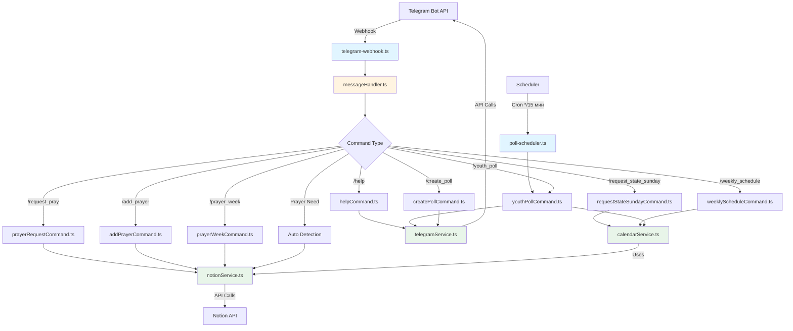
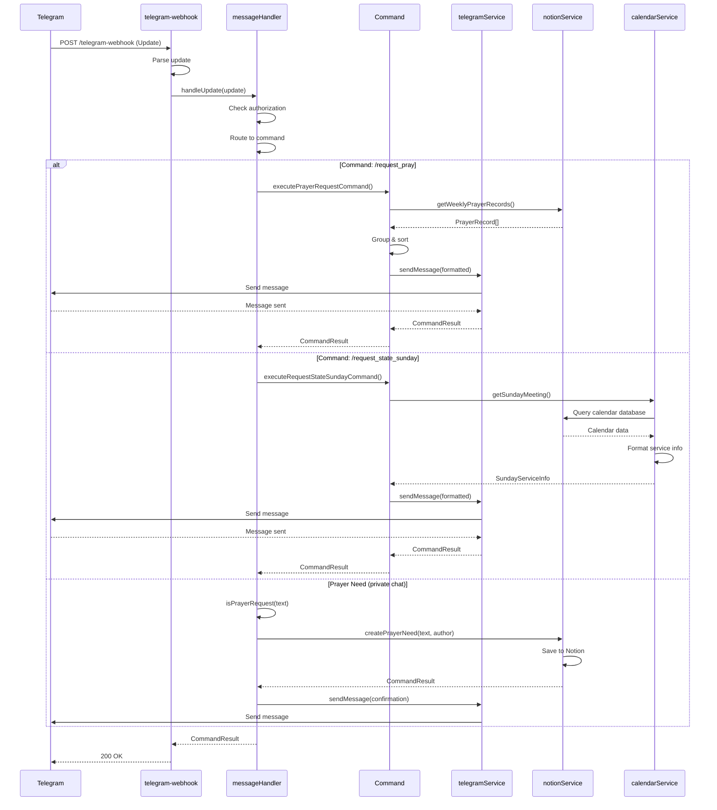
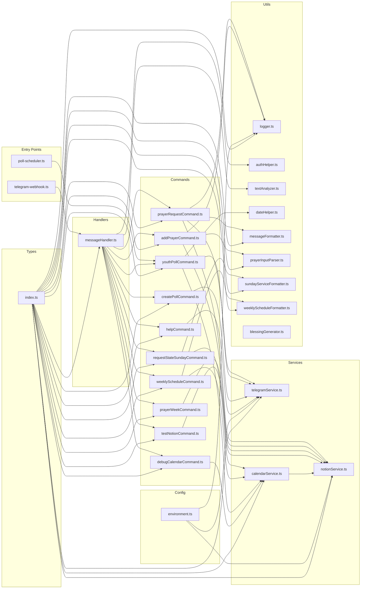

# Memory Bank - Church Management JS

> ⚠️ **Внимание**: Этот файл был разбит на отдельные файлы для лучшей организации.
> 
> Полная документация теперь находится в директории [`docs/`](docs/README.md)

## 📋 Содержание

Документация разбита на отдельные файлы в директории `docs/`:

1. [Обзор проекта](docs/overview.md)
2. [Архитектура проекта](docs/architecture.md)
3. [Структура файлов и директорий](docs/file-structure.md)
4. [Команды бота](docs/commands/README.md)
5. [Сервисы](docs/services/README.md)
6. [Утилиты](docs/utils/README.md)
7. [Конфигурация](docs/configuration.md)
8. [Netlify Functions](docs/netlify-functions.md)
9. [Типы данных](docs/types.md)
10. [Паттерны и соглашения](docs/patterns.md)
11. [Процесс деплоя](docs/deployment.md)
12. [Тестирование](docs/testing.md)
13. [Диаграммы](docs/diagrams.md)

**Начните с [главного индекса документации](docs/README.md)**

---

## Обзор проекта

### Описание

**Church Management JS** - это Telegram бот для управления церковными процессами, полностью переписанный с Django на функциональный JavaScript/TypeScript с использованием Netlify Functions. Бот интегрирован с Notion API для хранения и управления данными о молитвах, календаре, расписании служений и других церковных активностях.

### Основные возможности

- Управление молитвенными нуждами и записями
- Автоматическое создание опросов для молодежных встреч
- Получение информации о воскресных служениях
- каждые 15 минуте чтение Библии
- Недельное расписание служений
- Интеграция с Notion для хранения данных

### Технологии

- **Язык**: TypeScript (ES2020)
- **Платформа**: Node.js
- **Хостинг**: Netlify Functions (serverless)
- **API**: 
  - Telegram Bot API (через `node-telegram-bot-api`)
  - Notion API (через `@notionhq/client`)
- **Сборка**: TypeScript Compiler (tsc)
- **Менеджер пакетов**: Yarn

### Зависимости

**Основные:**
- `node-telegram-bot-api` - работа с Telegram Bot API
- `@notionhq/client` - клиент для Notion API
- `axios` - HTTP клиент
- `express` - веб-сервер (для локальной разработки)
- `@netlify/functions` - Netlify Functions runtime

**Разработка:**
- `typescript` - компилятор TypeScript
- `ts-node` - выполнение TypeScript напрямую
- `nodemon` - автоматическая перезагрузка при разработке
- `netlify-cli` - CLI для работы с Netlify
- `jest`, `ts-jest`, `@types/jest` - unit-тесты

---

## Архитектура проекта

### Функциональный подход

Проект использует **функциональный подход без классов**. Все компоненты реализованы как именованные функции и модули.

### Слоистая архитектура

Проект организован в следующие слои:

```
┌─────────────────────────────────────┐
│   Netlify Functions (Entry Point)   │
│   - telegram-webhook.ts             │
│   - poll-scheduler.ts          │
└──────────────┬──────────────────────┘
               │
┌──────────────▼──────────────────────┐
│   Handlers (Message Routing)        │
│   - messageHandler.ts                │
└──────────────┬──────────────────────┘
               │
┌──────────────▼──────────────────────┐
│   Commands (Business Logic)        │
│   - createPollCommand.ts            │
│   - prayerRequestCommand.ts         │
│   - ... (11 команд)                  │
└──────────────┬──────────────────────┘
               │
┌──────────────▼──────────────────────┐
│   Services (External APIs)          │
│   - telegramService.ts              │
│   - notionService.ts                │
│   - calendarService.ts              │
└──────────────┬──────────────────────┘
               │
┌──────────────▼──────────────────────┐
│   Utils (Helpers)                   │
│   - logger.ts, authHelper.ts        │
│   - dateHelper.ts, menuBuilder.ts   │
│   - ... (форматтеры, парсеры, state)│
└──────────────┬──────────────────────┘
               │
┌──────────────▼──────────────────────┐
│   Config (Configuration)             │
│   - environment.ts                   │
└─────────────────────────────────────┘
```

### Принципы архитектуры

1. **Разделение ответственности**: каждый слой имеет четкую ответственность
2. **Именованные экспорты**: все функции экспортируются именованно (не default)
3. **Singleton для клиентов**: Telegram и Notion клиенты создаются один раз
4. **Единый формат ответа**: все команды возвращают `CommandResult`
5. **Централизованное логирование**: все логи через единую систему

---

## Структура файлов и директорий

### Корневая структура

```
church-management-js/
├── src/                    # Исходный код приложения
├── netlify/               # Netlify Functions
│   └── functions/         # Serverless функции
├── scripts/               # Скрипты для деплоя и управления
├── dist/                  # Скомпилированный код (генерируется)
├── node_modules/          # Зависимости (генерируется)
├── coverage/              # Отчёт Jest (генерируется, в .gitignore)
├── .env                   # Переменные окружения (не в git)
├── package.json           # Конфигурация проекта и зависимости
├── tsconfig.json          # Конфигурация TypeScript
├── jest.config.js         # Конфигурация Jest
├── netlify.toml           # Конфигурация Netlify
└── README.md              # Основная документация
```

### Директория `src/`

#### `src/commands/` - Команды бота

Каждая команда - отдельный файл с функцией `execute*Command`:

- **`addPrayerCommand.ts`** - добавление молитвенной записи на неделю
  - Парсинг ввода пользователя
  - Валидация данных
  - Сохранение в Notion
  
- **`createPollCommand.ts`** - создание простого опроса
  - Создание опроса для молодежной встречи
  
- **`debugCalendarCommand.ts`** - отладочная команда для календаря
  - Проверка данных в календаре
  
- **`helpCommand.ts`** - справка по командам
  - Форматированный список всех команд
  
- **`prayerRequestCommand.ts`** - рассылка молитвенных нужд
  - Получение записей из Notion
  - Группировка по людям
  - Сортировка (по дате/имени)
  - Форматирование и отправка
  
- **`prayerWeekCommand.ts`** - информация о молитвах на следующую неделю
  - Фильтрация записей по датам
  - Группировка по людям
  
- **`requestStateSundayCommand.ts`** - информация о воскресном служении
  - Получение данных из календаря
  - Форматирование информации о службах
  
- **`testNotionCommand.ts`** - тестирование подключения к Notion
  - Проверка доступности баз данных
  
- **`weeklyScheduleCommand.ts`** - расписание служений на неделю
  - Получение событий из календаря
  - Фильтрация по флагу "нужна рассылка"
  
- **`youthPollCommand.ts`** - создание опроса для молодежного служения
  - Проверка события на завтра
  - Извлечение темы и времени
  - Создание опроса в группе

- **`autoPollCommand.ts`** — авто-опросы (poll-scheduler): getYouthEventsForDateRange, shouldSendPoll; только «МОСТ».
- **`fillSundayServiceCommand.ts`** — многошаговая форма воскресного служения.
- **`editScheduleCommand.ts`** — многошаговая форма недельного расписания.
- **`youthReportCommand.ts`** — многошаговая форма отчёта молодёжи.
- **`showMenuCommand.ts`** — главное меню с inline-кнопками.

#### `src/services/` - Сервисы для работы с внешними API

- **`telegramService.ts`** - работа с Telegram Bot API
  - Singleton для экземпляра бота
  - Функции отправки сообщений, опросов, фото
  - Поддержка debug/production режимов
  - Работа с топиками в супергруппах
  
- **`notionService.ts`** - интеграция с Notion API
  - Singleton для Notion клиента
  - CRUD операции с базами данных:
    - Молитвенные нужды
    - Календарь
    - каждые 15 минуте чтение
    - Недельные молитвенные записи
  - Получение молодежных событий
  
- **`calendar/`** — календарь и расписание (подмодули); фасад — `calendarService.ts`.
  - **`sundayService.ts`** — воскресные службы (I/II поток), маппинг Notion.
  - **`weeklySchedule.ts`** — недельное расписание, маппинг Notion.
  - **`debug.ts`** — debugCalendarDatabase.
  - **`index.ts`** — реэкспорт.

#### `src/handlers/` - Обработчики сообщений

- **`messageHandler.ts`** - главный обработчик сообщений
  - `handleUpdate(update)` — точка входа (message, callback_query)
  - Маршрутизация команд, проверка авторизации (isUserAuthorized, isYouthLeader для youth_report)
  - Обработка молитвенных нужд (в приватных чатах), игнорирование не-команд в группах
- **`messageHandler.test.ts`** - unit-тесты handleUpdate (/help auth, callback menu:main, no message)
- **`scriptureScheduleHandler.ts`** - обработка графика чтений Писания
  - Парсинг пересланного/вставленного графика, создание/обновление воскресных служб в Notion

#### `src/utils/` - Вспомогательные функции

- **`logger.ts`** - система логирования
  - Уровни: debug, info, warn, error
  - Форматы: JSON, text
  - Конфигурируемый уровень логирования
  
- **`authHelper.ts`** - проверка авторизации
  - Проверка ID пользователя в списке разрешенных
  - Сообщение об отказе в доступе
  
- **`textAnalyzer.ts`** - анализ текста
  - Определение молитвенных нужд
  - Категоризация молитвенных нужд
  - Извлечение ключевых слов
  
- **`dateHelper.ts`** - работа с датами
  - Форматирование дат (полное, краткое)
  - Форматирование времени
  - Вычисления (добавление дней, проверка периода)
  
- **`messageFormatter.ts`** - форматирование сообщений
  - Форматирование списка людей для молитвы
  - Группировка записей по людям
  - Сортировка (по имени, по дате)
  
- **`prayerInputParser.ts`** - парсинг ввода молитв
  - Парсинг формата: "Имя | Тема | Неделя"
  - Валидация данных
  - Вычисление дат недели (current/next)
  
- **`sundayServiceFormatter.ts`** - форматирование воскресных служб
  - Форматирование информации о службах
  - Обработка отсутствующих данных
  
- **`weeklyScheduleFormatter.ts`** - форматирование недельного расписания
  - Группировка по датам
  - Добавление благословений
  - Форматирование с эмодзи
  
- **`blessingGenerator.ts`** - генератор благословений
  - Коллекция библейских благословений
  - Случайный выбор благословения
  - Форматирование для сообщений

- **`menuBuilder.ts`** — меню с inline-кнопками.
- **`stateStore.ts`** — состояние форм (Supabase или in-memory).
- **`prayerState.ts`** / **`prayerFormBuilder.ts`** — `/add_prayer`.
- **`scheduleState.ts`** / **`scheduleFormBuilder.ts`** — `/edit_schedule`.
- **`sundayServiceState.ts`** / **`sundayServiceFormBuilder.ts`** — `/fill_sunday_service`.
- **`youthReportState.ts`** / **`youthReportFormBuilder.ts`** — `/youth_report`.
- **`pollScheduler.ts`** — shouldSendPoll, shouldSendNotification.
- **`pollTextGenerator.ts`** — текст опросов (autoPoll).
- **`scriptureScheduleParser.ts`** — парсинг графика чтений.

#### `src/config/` - Конфигурация

- **`environment.ts`** - управление переменными окружения
  - Получение конфигурации Telegram
  - Получение конфигурации Notion
  - Получение конфигурации приложения
  - Валидация обязательных переменных

- **`appConfigStore.ts`** — конфиг из Supabase (`app_config`, `allowed_users`) или `process.env`; `ensureAppConfigLoaded()`, `getAppConfigValue()`, `getAllowedUsers()`.

#### `src/types/` - Типы данных

- **`index.ts`** - все TypeScript интерфейсы и типы
  - Telegram типы (Update, Message, User)
  - Notion типы (Page, RichText, Select, Date, и т.д.)
  - Доменные типы (PrayerNeed, CalendarItem, DailyScripture, и т.д.)
  - Типы результатов команд (CommandResult)
  - Типы конфигурации (LoggerConfig)

#### `src/index.ts` - Точка входа

- Инициализация приложения
- Валидация окружения
- Настройка логирования

### Директория `netlify/functions/`

- **`telegram-webhook.ts`** - обработчик webhook от Telegram
  - Прием обновлений от Telegram (в т.ч. `callback_query`)
  - CORS обработка (OPTIONS, POST)
  - `ensureAppConfigLoaded()`, парсинг body → вызов `handleUpdate(update)`
  - Возврат ответа (statusCode, headers, body)
- **`telegram-webhook.test.ts`** - unit-тесты handler (OPTIONS, POST пустой/валидный update)

- **`poll-scheduler.ts`** - scheduled функция (*/15 мин каждые 15 минут)
  - Только «Молодежное»: `getYouthEventForTomorrow` → `executeAutoPollForEvent`

- **`poll-scheduler.ts`** — каждые 15 минут; только «МОСТ»; `getYouthEventsForDateRange`, `shouldSendPoll`, `executeAutoPollForEvent`.
- **`poll-scheduler.ts`** — напоминания о закрытии опросов.

### Директория `scripts/`

- **`setup.sh`** - первоначальная настройка проекта
- **`deploy.sh`** - деплой в Netlify
- **`webhook-manager.sh`** - управление webhook
- **`ngrok-test.sh`** - тестирование с ngrok
- **`seed-supabase-from-env.ts`** — наполнение Supabase из `.env`
- **`supabase-schema.sql`** — схема БД (в т.ч. `user_form_state`)
- **`README.md`** - документация по скриптам

#### `scripts/test/` - интеграционные скрипты

- **`test-calendar.js`** — экспорты calendarService, formatServiceInfo, getSundayMeeting, getWeeklySchedule
- **`test-auto-poll.js`**, **`test-auto-poll-scheduler.sh`** — тесты авто-опросов
- **`test-youth-poll.js`**, **`test-auto-poll-scheduler.sh`** — тесты youth-poll
- **`test-bot-webhook.sh`**, **`test-webhook.js`** — тесты webhook
- **`test-debug.sh`** — тесты debug-сервера
- **`test-most-youth-poll.js`** — тест «большинство придут»
- **`cron-simulation.sh`** — симуляция cron
- **`require-dist.js`** — загрузка скомпилированных модулей для тестов
- **`README.md`** — описание (см. также TESTING-GUIDE в корне)

Запуск: `yarn test:integration` (сборка + test-calendar + test-auto-poll + test-youth-poll).

### Конфигурационные файлы

- **`package.json`** - зависимости и скрипты проекта
- **`tsconfig.json`** - настройки TypeScript компилятора (`**/*.test.ts` в exclude)
- **`jest.config.js`** - Jest (preset: ts-jest, testMatch: **/*.test.ts, collectCoverageFrom: src, netlify/functions)
- **`netlify.toml`** - конфигурация Netlify (build, functions, schedule)
- **`env.example`** - пример переменных окружения

---

## Команды бота

### Общая информация

Все команды требуют авторизации (проверка ID пользователя в `ALLOWED_USERS`). В группах обрабатываются только команды (сообщения без `/` игнорируются). В приватных чатах также обрабатываются молитвенные нужды (автоматическое определение).

### Список команд

#### `/help` - Справка по командам

**Назначение**: Показывает список всех доступных команд с описанием.

**Параметры**: Нет

**Пример использования**:
```
/help
```

**Реализация**: `src/commands/helpCommand.ts`

```typescript
export const executeHelpCommand = async (
  userId: number,
  chatId: number
): Promise<CommandResult>
```

---

#### `/create_poll` - Создание опроса

**Назначение**: Создает простой опрос о посещении молодежной встречи.

**Параметры**: Нет

**Пример использования**:
```
/create_poll
```

**Реализация**: `src/commands/createPollCommand.ts`

**Опции опроса**:
- "Да, приду"
- "Нет, не смогу"
- "Пока не знаю"

---

#### `/request_pray` - Рассылка молитвенных нужд

**Назначение**: Отправляет рассылку с информацией о людях, за которых нужно молиться, с датами последней молитвы.

**Параметры**:
- `date` или `дата` (опционально) - сортировка по дате (по умолчанию)
- `name` или `имя` (опционально) - сортировка по алфавиту

**Пример использования**:
```
/request_pray
/request_pray date
/request_pray name
```

**Реализация**: `src/commands/prayerRequestCommand.ts`

**Функциональность**:
- Получает все записи из Notion
- Группирует по людям, находит последнюю дату молитвы
- Отправляет полный список
- Отправляет список из 5 человек «давно не молились» (сортировка по дате, старые первыми)

**Режим DEBUG**: В режиме DEBUG рассылка не отправляется.

---

#### `/add_prayer` - Добавление молитвенной записи

**Назначение**: Добавляет молитвенную запись на текущую или следующую неделю.

**Параметры**: 
- Без параметров - показывает справку
- С параметрами: `Имя | Тема | Неделя`

**Формат ввода**:
```
Имя | Тема | Неделя (current/next)
```

**Пример использования**:
```
/add_prayer
/add_prayer Иван Петров | Здоровье | current
/add_prayer Мария Сидорова | Работа | next
```

**Реализация**: `src/commands/addPrayerCommand.ts`

**Валидация**:
- Имя: минимум 2 символа
- Тема: минимум 3 символа
- Неделя: `current` или `next`

**Недели**:
- `current` - текущая неделя (понедельник - воскресенье)
- `next` - следующая неделя

---

#### `/request_state_sunday` - Информация о воскресном служении

**Назначение**: Получает и отправляет информацию о ближайшем воскресном служении.

**Параметры**: Нет

**Пример использования**:
```
/request_state_sunday
```

**Реализация**: `src/commands/requestStateSundayCommand.ts`

**Информация включает**:
- Дата служения
- Служения (I и II поток):
  - Проповедники
  - Служение прославления
  - Песня перед началом
  - Количество песен прославления
  - Соло песня
  - Песня покаяния
  - Чтение Писания
  - Чтец

**Режим DEBUG**: В режиме DEBUG рассылка не отправляется.

---

#### `/weekly_schedule` - Недельное расписание

**Назначение**: Получает и отправляет расписание служений на предстоящую неделю, которые требуют рассылки.

**Параметры**: Нет

**Пример использования**:
```
/weekly_schedule
```

**Реализация**: `src/commands/weeklyScheduleCommand.ts`

**Информация включает**:
- Период недели
- Служения по дням:
  - Время
  - Название
  - Описание
  - Место проведения
- Случайное благословение

**Режим DEBUG**: В режиме DEBUG рассылка не отправляется.

---

#### `/prayer_week` - Молитвы на следующую неделю

**Назначение**: Показывает информацию о людях, за которых нужно молиться на следующую неделю, и темы молитв.

**Параметры**: Нет

**Пример использования**:
```
/prayer_week
```

**Реализация**: `src/commands/prayerWeekCommand.ts`

**Функциональность**:
- Вычисляет даты следующей недели (понедельник - воскресенье)
- Фильтрует записи, которые пересекаются с этим периодом
- Группирует по людям
- Показывает тему молитвы и период

---

#### Автоматическое создание опросов для молодежного служения

**Назначение**: Опросы о посещении молодежного служения создаются **автоматически** через Netlify Scheduled Function.

**Автоматизация**: Опросы создаются автоматически каждые 15 минут в **каждые 15 минут** через функцию `poll-scheduler`.

**Реализация**: 
- `netlify/functions/poll-scheduler.ts` - scheduled функция
- `src/commands/youthPollCommand.ts` - функция `executeAutoPollForEvent`

**Функциональность**:
- Автоматически проверяет наличие молодежного события на завтра в календаре Notion
- Извлекает тему и время из события
- Создает опрос в молодежной группе
- Поддерживает debug режим (отправка в тестовую группу)

**Опции опроса**:
- "Конечно, буду! 🔥"
- "К сожалению, не буду 😔"

**Примечание**: Ручной запуск команды `/youth_poll` отключен, так как опросы создаются автоматически.

---

#### `/debug_calendar` - Отладка календаря

**Назначение**: Отладочная команда для проверки данных в календаре Notion.

**Параметры**: Нет

**Пример использования**:
```
/debug_calendar
```

**Реализация**: `src/commands/debugCalendarCommand.ts`

---

#### `/test_notion` - Тест подключения к Notion

**Назначение**: Проверяет подключение к Notion API и доступность баз данных.

**Параметры**: Нет

**Пример использования**:
```
/test_notion
```

**Реализация**: `src/commands/testNotionCommand.ts`

---

### Автоматическая обработка молитвенных нужд

В **приватных чатах** бот автоматически определяет молитвенные нужды по ключевым словам и сохраняет их в Notion.

**Ключевые слова**: молитесь, помолитесь, молитва, просьба, нужда, помогите, поддержите, благословите

**Категории**:
- здоровье
- семья
- работа
- духовность
- путешествие
- общее

---

## Сервисы

### TelegramService

**Файл**: `src/services/telegramService.ts`

**Назначение**: Работа с Telegram Bot API.

**Основные функции**:

#### Singleton паттерн
```typescript
let botInstance: TelegramBot | null = null;

export const getTelegramBot = (): TelegramBot => {
  if (!botInstance) {
    const config = getTelegramConfig();
    botInstance = new TelegramBot(config.botToken, { polling: false });
  }
  return botInstance;
};
```

#### Режимы работы
- **Production**: основной бот и группа
- **Debug**: тестовый бот и группа (если настроено)

```typescript
export const getTelegramConfigForMode = (isDebug: boolean) => {
  // Возвращает конфигурацию для нужного режима
};
```

#### Функции отправки

- **`sendMessage(chatId, text, options?)`** - отправка текстового сообщения
- **`sendMessageToUser(userId, text, options?)`** - отправка пользователю
- **`sendPoll(bot, chatId, question, options, messageThreadId?)`** - отправка опроса
  - Поддержка топиков в супергруппах через `messageThreadId`
- **`sendPhoto(chatId, photo, caption?)`** - отправка фото

**Особенности**:
- Все функции возвращают `CommandResult`
- Логирование всех операций
- Обработка ошибок

---

### NotionService

**Файл**: `src/services/notionService.ts`

**Назначение**: Интеграция с Notion API для работы с базами данных.

**Основные функции**:

#### Singleton паттерн
```typescript
let notionClient: Client | null = null;

export const getNotionClient = (): Client => {
  if (!notionClient) {
    const config = getNotionConfig();
    notionClient = new Client({ auth: config.token });
  }
  return notionClient;
};
```

#### Работа с молитвенными нуждами

- **`createPrayerNeed(text, author, category?)`** - создание молитвенной нужды
- **`getActivePrayerNeeds()`** - получение активных молитвенных нужд

**База данных**: `NOTION_PRAYER_DATABASE`

**Поля**:
- Текст (rich_text)
- Автор (rich_text)
- Дата (date)
- Статус (select: Активная, Отвеченная, Архивированная)
- Категория (select, опционально)

#### Работа с календарем

- **`getCalendarItems(startDate?, endDate?)`** - получение событий календаря
- **`getYouthEventForTomorrow()`** - получение молодежного события на завтра

**База данных**: `NOTION_GENERAL_CALENDAR_DATABASE`

**Поля**:
- Название (title)
- Дата (date)
- Описание (rich_text)
- Тип (select)
- Тип служения (select: Молодежное, и т.д.)
- Тема (rich_text, в различных полях)

#### каждые 15 минуте чтение

- **`getDailyScripture(date?)`** - получение каждые 15 минутго чтения

**База данных**: `NOTION_DAILY_DISTRIBUTION_DATABASE`

**Поля**:
- Дата (date)
- Текст (rich_text)
- Ссылка (rich_text)
- Перевод (rich_text)

#### Недельные молитвенные записи

- **`getWeeklyPrayerRecords()`** - получение всех записей
- **`createWeeklyPrayerRecord(prayerInput)`** - создание записи

**База данных**: `NOTION_WEEKLY_PRAYER_DATABASE`

**Поля**:
- Дата молитвы (date, диапазон)
- Молитвенное лицо (select)
- Тема молитвы (rich_text)
- Примечание (title)
- Column (title: current/next)

**Особенности**:
- Обработка различных форматов полей Notion
- Логирование операций
- Обработка ошибок с возвратом пустых массивов

---

### CalendarService

Реализация в `src/services/calendar/` (sundayService, weeklySchedule, debug); реэкспорт через `calendarService.ts`.

**Файл**: `src/services/calendarService.ts` (фасад), `src/services/calendar/` (подмодули)

**Назначение**: Работа с календарем и расписанием служений.

**Основные функции**:

#### Воскресные службы

- **`getSundayMeeting()`** - получение информации о ближайшем воскресном служении
- **`formatServiceInfo(serviceInfo)`** - форматирование информации о службах

**Типы служб**:
- `Воскресное-1` - I поток
- `Воскресное-2` - II поток

**Информация о службе**:
- Название служения
- Дата
- Проповедники (multi_select)
- Служение прославления (select)
- Песня перед началом (checkbox)
- Количество песен прославления (number)
- Соло песня (checkbox)
- Песня покаяния (checkbox)
- Чтение Писания (rich_text)
- Чтец (rich_text)

#### Недельное расписание

- **`getWeeklySchedule()`** - получение расписания на предстоящую неделю
- **`getScheduleServiceById(serviceId)`** — получение служения по ID
- **`getScheduleServicesForWeek(weekType?)`** — служения на неделю (без фильтра «нужна рассылка»)
- **`createScheduleService(serviceData)`** — создание служения в Notion
- **`updateScheduleService(serviceId, serviceData)`** — обновление служения в Notion

**Фильтрация** (getWeeklySchedule):
- События с флагом "нужна рассылка" (checkbox)
- События на предстоящую неделю

**Информация о событии**:
- Название
- Дата и время
- Тип
- Описание
- Место проведения
- Флаг "нужна рассылка"

#### Отладочные функции

- **`debugCalendarDatabase()`** - вывод информации о записях в календаре

**Особенности**:
- Использование NotionService для доступа к данным
- Форматирование данных для отображения
- Обработка различных форматов полей

---

## Утилиты

### Logger

**Файл**: `src/utils/logger.ts`

**Назначение**: Централизованная система логирования.

**Уровни логирования**:
- `debug` - отладочная информация
- `info` - информационные сообщения
- `warn` - предупреждения
- `error` - ошибки

**Форматы**:
- `json` - JSON формат (по умолчанию)
- `text` - текстовый формат

**Функции**:
- `logDebug(message, data?)` - отладочное сообщение
- `logInfo(message, data?)` - информационное сообщение
- `logWarn(message, data?)` - предупреждение
- `logError(message, error?)` - ошибка
- `setLoggerConfig(config)` - настройка логгера

**Конфигурация**:
- `LOG_LEVEL` - уровень логирования
- `LOG_FORMAT` - формат логирования

**Пример**:
```typescript
logInfo("Processing message", {
  userId: 123456789,
  chatId: -1001234567890,
  text: "Hello"
});
```

---

### AuthHelper

**Файл**: `src/utils/authHelper.ts`

**Назначение**: Проверка авторизации пользователей.

**Функции**:
- `isUserAuthorized(userId)` - проверка, авторизован ли пользователь
- `isYouthLeader(userId)` - проверка, является ли пользователь лидером молодёжи (Notion)
- `getUnauthorizedMessage()` - сообщение об отказе в доступе

**Логика**:
- Проверка ID пользователя в списке `ALLOWED_USERS` (или из app_config/Supabase)
- Логирование попыток доступа
- Возврат понятного сообщения об отказе

---

### TextAnalyzer

**Файл**: `src/utils/textAnalyzer.ts`

**Назначение**: Анализ текста для определения молитвенных нужд.

**Функции**:
- `isPrayerRequest(text)` - определение, является ли текст молитвенной просьбой
- `categorizePrayerNeed(text)` - категоризация молитвенной нужды
- `extractPrayerKeywords(text)` - извлечение ключевых слов

**Категории**:
- здоровье
- семья
- работа
- духовность
- путешествие
- общее (по умолчанию)

---

### DateHelper

**Файл**: `src/utils/dateHelper.ts`

**Назначение**: Работа с датами и временем.

**Функции**:
- `formatDate(date)` - полное форматирование даты (день недели, число, месяц, год)
- `formatDateShort(date)` - краткое форматирование (число, месяц, год)
- `formatTime(date)` - форматирование времени (часы:минуты)
- `getCurrentDate()` - получение текущей даты
- `addDays(date, days)` - добавление дней к дате
- `isToday(date)` - проверка, является ли дата сегодняшней
- `isThisWeek(date)` - проверка, находится ли дата в текущей неделе
- `formatDateForNotion(date)` - YYYY-MM-DD для Notion (локальное время)

**Локализация**: Все функции используют русскую локализацию (`ru-RU`), кроме `formatDateForNotion`.

---

### MessageFormatter

**Файл**: `src/utils/messageFormatter.ts`

**Назначение**: Форматирование сообщений для молитвенных рассылок.

**Функции**:
- `formatAllPeopleMessage(peopleInfo, sortDescription?)` - форматирование полного списка людей
- `formatOldPrayersMessage(oldPeople)` - форматирование списка «давно не молились»
- `groupPrayerRecordsByPerson(records)` - группировка записей по людям
- `sortPeopleByName(peopleInfo)` - сортировка по имени
- `sortPeopleByDate(peopleInfo)` - сортировка по дате
- `getOldPrayersForSelection(records, limit?)` - топ N по давности молитвы

**Форматирование**:
- Использование HTML разметки
- Эмодзи для визуального оформления
- Разделители между записями

---

### PrayerInputParser

**Файл**: `src/utils/prayerInputParser.ts`

**Назначение**: Парсинг и валидация ввода молитвенных записей.

**Функции**:
- `parsePrayerInput(input)` - парсинг ввода
- `calculateWeekDates(weekType)` - вычисление дат недели
- `formatDateRange(start, end)` - форматирование диапазона дат
- `createWeeklyPrayerInput(parsed)` - создание объекта для сохранения
- `getPrayerInputHelp()` - справка по формату

**Формат ввода**:
```
Имя | Тема | Неделя (current/next)
```

**Валидация**:
- Имя: минимум 2 символа
- Тема: минимум 3 символа
- Неделя: `current` или `next`

**Вычисление недель**:
- Неделя начинается с понедельника
- Неделя заканчивается воскресеньем
- Учитывается текущий день недели

---

### SundayServiceFormatter

**Файл**: `src/utils/sundayServiceFormatter.ts`

**Назначение**: Форматирование информации о воскресных службах.

**Функции**:
- `formatSundayServiceMessage(serviceInfo)` - форматирование сообщения
- `formatServiceType(type)` - форматирование типа службы
- `formatBooleanValue(value)` - форматирование булевых значений
- `formatNumberValue(value)` - форматирование чисел
- `formatTextValue(value)` - форматирование текста
- `formatNamesArray(names)` - форматирование массива имен

**Особенности**:
- Обработка отсутствующих данных
- Понятные сообщения об ошибках
- Использование CalendarService для форматирования

---

### WeeklyScheduleFormatter

**Файл**: `src/utils/weeklyScheduleFormatter.ts`

**Назначение**: Форматирование недельного расписания.

**Функции**:
- `formatWeeklyScheduleMessage(scheduleInfo)` - форматирование сообщения
- Группировка по датам
- Добавление благословений
- Форматирование с эмодзи

**Структура сообщения**:
- Заголовок с периодом недели
- Служения по дням:
  - День недели и дата
  - Время и название
  - Описание
  - Место проведения
- Случайное благословение
- Хештег для поиска

---

### BlessingGenerator

**Файл**: `src/utils/blessingGenerator.ts`

**Назначение**: Генерация библейских благословений.

**Функции**:
- `getRandomBlessing()` - получение случайного благословения
- `formatBlessing(blessing)` - форматирование благословения

**Коллекция**: Более 20 библейских благословений из Синодального перевода.

**Формат**:
- Текст благословения
- Ссылка на стих

---

## Конфигурация

### Переменные окружения

Все переменные окружения настраиваются в файле `.env` (создается из `env.example`).

#### Telegram Configuration

- **`TELEGRAM_BOT_TOKEN`** (обязательно) - токен основного бота
- **`ALLOWED_USERS`** (обязательно) - список ID авторизованных пользователей через запятую
  - Пример: `282850458,123456789`
- **`TELEGRAM_MAIN_CHANNEL_ID`** - ID основного канала
- **`TELEGRAM_MAIN_GROUP_ID`** - ID основной группы
- **`TELEGRAM_YOUTH_GROUP_ID`** - ID молодежной группы
- **`TELEGRAM_WEBHOOK_URL`** - URL для webhook (настраивается автоматически)

#### Debug Telegram Configuration

- **`TELEGRAM_BOT_TOKEN_DEBUG`** - токен тестового бота
- **`TELEGRAM_CHAT_ID_DEBUG`** - ID тестового чата
- **`TELEGRAM_TOPIC_ID_DEBUG`** - ID топика в тестовом чате

#### Notion Configuration

- **`NOTION_TOKEN`** (обязательно) - токен интеграции Notion
- **`NOTION_PRAYER_DATABASE`** (обязательно) - ID базы данных молитвенных нужд
- **`NOTION_GENERAL_CALENDAR_DATABASE`** (обязательно) - ID базы данных календаря
- **`NOTION_DAILY_DISTRIBUTION_DATABASE`** (обязательно) - ID базы данных каждые 15 минутго чтения
- **`NOTION_WEEKLY_PRAYER_DATABASE`** (обязательно) - ID базы данных недельных молитвенных записей

#### Application Configuration

- **`NODE_ENV`** - окружение (`development` или `production`)
- **`DEBUG`** - режим отладки (`true` или `false`)
- **`LOG_LEVEL`** - уровень логирования (`debug`, `info`, `warn`, `error`)
- **`LOG_FORMAT`** - формат логирования (`json` или `text`)

#### Netlify Configuration

- **`NETLIFY_SITE_URL`** - URL сайта Netlify (используется для webhook)

### Валидация окружения

Функция `validateEnvironment()` проверяет наличие всех обязательных переменных при запуске приложения.

**Обязательные переменные**:
- `TELEGRAM_BOT_TOKEN`
- `NOTION_TOKEN`
- `NOTION_PRAYER_DATABASE`
- `NOTION_GENERAL_CALENDAR_DATABASE`
- `NOTION_DAILY_DISTRIBUTION_DATABASE`
- `NOTION_WEEKLY_PRAYER_DATABASE`

### Режимы работы

#### Development
- `NODE_ENV=development`
- Более подробное логирование
- Debug режим доступен

#### Production
- `NODE_ENV=production`
- Минимальное логирование
- Все функции работают в полном режиме

#### Debug
- `DEBUG=true` или `NODE_ENV=development`
- Рассылки не отправляются
- Используется тестовый бот (если настроен)
- Отправка в тестовую группу

---

## Netlify Functions

### telegram-webhook

**Файл**: `netlify/functions/telegram-webhook.ts`

**Назначение**: Обработчик webhook от Telegram.

**Триггер**: HTTP POST запрос от Telegram

**Функциональность**:
1. Обработка CORS (preflight OPTIONS)
2. Валидация метода (только POST)
3. `ensureAppConfigLoaded()`, парсинг body (JSON)
4. Вызов `handleUpdate(update)` из messageHandler
5. Возврат результата (statusCode 200/405/500, headers, body)

**Ответы**:
- `200 OK` - успешная обработка
- `405 Method Not Allowed` - неверный метод
- `500 Internal Server Error` - ошибка обработки

**CORS заголовки**:
- `Access-Control-Allow-Origin: *`
- `Access-Control-Allow-Headers: Content-Type`
- `Access-Control-Allow-Methods: POST, OPTIONS`

---

### poll-scheduler

**Файл**: `netlify/functions/poll-scheduler.ts`

**Назначение**: Автоматическое создание опроса для молодежного служения.

**Триггер**: Scheduled функция (cron)

**Расписание**: каждые 15 минут в */15 мин (каждые 15 минут по московскому времени)

**Конфигурация в `netlify.toml`**:
```toml
[functions."poll-scheduler"]
  schedule = "*/15 * * * *"
```

**Функциональность**:
1. Вызов `executeAutoPollForEvent()`
2. Проверка события на завтра
3. Создание опроса в группе
4. Логирование результата

**Ответы**:
- `200 OK` - успешное выполнение
- `500 Internal Server Error` - ошибка

---

## Типы данных

### Telegram типы

**Файл**: `src/types/index.ts`

#### TelegramUser
```typescript
interface TelegramUser {
  id: number;
  username?: string;
  first_name: string;
  last_name?: string;
}
```

#### TelegramMessage
```typescript
interface TelegramMessage {
  message_id: number;
  from: TelegramUser;
  chat: {
    id: number;
    type: string;
    title?: string;
  };
  text?: string;
  date: number;
}
```

#### TelegramUpdate
```typescript
interface TelegramUpdate {
  update_id: number;
  message?: TelegramMessage;
  poll?: { ... };
  poll_answer?: { ... };
}
```

### Доменные типы

#### PrayerNeed
```typescript
interface PrayerNeed {
  id: string;
  text: string;
  author: string;
  date: Date;
  status: "active" | "answered" | "archived";
  category?: string;
}
```

#### CalendarItem
```typescript
interface CalendarItem {
  id: string;
  title: string;
  date: Date;
  description?: string;
  theme?: string;
  type: "service" | "meeting" | "event";
}
```

#### DailyScripture
```typescript
interface DailyScripture {
  id: string;
  date: Date;
  text: string;
  reference: string;
  translation: string;
}
```

#### PrayerRecord
```typescript
interface PrayerRecord {
  id: string;
  person: string;
  topic: string;
  note: string;
  column?: string;
  dateStart: Date;
  dateEnd: Date;
}
```

#### WeeklyPrayerInput
```typescript
interface WeeklyPrayerInput {
  person: string;
  topic: string;
  note?: string;
  weekType: "current" | "next";
  dateStart: Date;
  dateEnd: Date;
}
```

#### SundayServiceItem
```typescript
interface SundayServiceItem {
  id: string;
  title: string;
  date: Date;
  type: string;
  preachers: NotionMultiSelectOption[];
  worshipService: string;
  songBeforeStart: boolean;
  numWorshipSongs: number | null;
  soloSong: boolean;
  repentanceSong: boolean;
  scriptureReading: string;
  scriptureReader: string;
}
```

#### WeeklyServiceItem
```typescript
interface WeeklyServiceItem {
  id: string;
  title: string;
  date: Date;
  time?: string;
  type: string;
  description?: string;
  location?: string;
  needsMailing: boolean;
}
```

### Типы результатов

#### CommandResult
```typescript
interface CommandResult {
  success: boolean;
  message?: string;
  data?: Record<string, unknown>;
  error?: string;
}
```

**Использование**:
- Все команды возвращают `CommandResult`
- Унифицированная обработка результатов
- Легкая обработка ошибок

#### LoggerConfig
```typescript
interface LoggerConfig {
  level: "debug" | "info" | "warn" | "error";
  format: "json" | "text";
}
```

### Notion типы

Интерфейсы для работы с полями Notion:
- `NotionPage` - страница Notion
- `NotionRichText` - текстовое поле
- `NotionSelect` - поле выбора
- `NotionDate` - поле даты
- `NotionTitle` - заголовок
- `NotionMultiSelect` - множественный выбор
- `NotionCheckbox` - чекбокс
- `NotionNumber` - число

---

## Паттерны и соглашения

### Функциональный подход

Проект использует **функциональный подход без классов**. Все компоненты реализованы как функции и модули.

**Принципы**:
- Нет классов, только функции
- Именованные экспорты (не default)
- Чистые функции где возможно
- Минимум побочных эффектов

### Именованные экспорты

Все функции экспортируются именованно:

```typescript
// ✅ Правильно
export const executeHelpCommand = async (...) => { ... };

// ❌ Неправильно
export default async function executeHelpCommand(...) { ... }
```

**Преимущества**:
- Явные зависимости
- Лучшая поддержка IDE
- Легче рефакторинг

### CommandResult паттерн

Все команды возвращают единый формат результата:

```typescript
interface CommandResult {
  success: boolean;
  message?: string;
  data?: Record<string, unknown>;
  error?: string;
}
```

**Использование**:
```typescript
if (result.success) {
  // Обработка успеха
} else {
  // Обработка ошибки
  logError("Command failed", result.error);
}
```

### Singleton для клиентов

Telegram и Notion клиенты создаются один раз и переиспользуются:

```typescript
let botInstance: TelegramBot | null = null;

export const getTelegramBot = (): TelegramBot => {
  if (!botInstance) {
    botInstance = new TelegramBot(config.botToken, { polling: false });
  }
  return botInstance;
};
```

**Преимущества**:
- Экономия ресурсов
- Единая точка доступа
- Легкое тестирование

### Обработка ошибок

**Принципы**:
1. Все ошибки логируются
2. Пользователю отправляется понятное сообщение
3. Возвращается `CommandResult` с `success: false`

**Пример**:
```typescript
try {
  const result = await someOperation();
  return { success: true, data: result };
} catch (error) {
  logError("Operation failed", error);
  return {
    success: false,
    error: "Произошла ошибка при выполнении операции"
  };
}
```

### Логирование

**Принципы**:
1. Логирование всех важных операций
2. Использование правильного уровня логирования
3. Структурированные данные в логах

**Уровни**:
- `debug` - детальная отладочная информация
- `info` - информационные сообщения о работе
- `warn` - предупреждения (неавторизованный доступ, и т.д.)
- `error` - ошибки выполнения

**Пример**:
```typescript
logInfo("Processing message", {
  userId: 123456789,
  chatId: -1001234567890,
  command: "/help"
});
```

### Структура команд

Все команды следуют единой структуре:

```typescript
export const executeCommandName = async (
  userId: number,
  chatId: number,
  params: string[] = []
): Promise<CommandResult> => {
  logInfo("Executing command", { userId, chatId, params });
  
  try {
    // Проверка режима DEBUG
    if (appConfig.debug) {
      return await sendMessage(chatId, "DEBUG mode active");
    }
    
    // Основная логика
    const result = await doSomething();
    
    // Форматирование и отправка
    const message = formatResult(result);
    return await sendMessage(chatId, message);
  } catch (error) {
    logError("Command failed", error);
    return {
      success: false,
      error: "Произошла ошибка"
    };
  }
};
```

### Именование файлов

**Соглашения**:
- Команды: `*Command.ts` (например, `helpCommand.ts`)
- Сервисы: `*Service.ts` (например, `telegramService.ts`)
- Утилиты: `*Helper.ts`, `*Formatter.ts`, `*Parser.ts`
- Обработчики: `*Handler.ts`
- Типы: `index.ts` в директории `types/`

### Комментарии в коде

**Принципы**:
- Комментарии на английском языке
- JSDoc для публичных функций
- Объяснение сложной логики

**Пример**:
```typescript
/**
 * Execute /help command
 * Shows list of available commands with descriptions
 * @param userId - Telegram user ID
 * @param chatId - Telegram chat ID
 * @returns CommandResult with help message
 */
export const executeHelpCommand = async (
  userId: number,
  chatId: number
): Promise<CommandResult> => {
  // Implementation
};
```

---

## Процесс деплоя

### Настройка окружения

#### 1. Установка зависимостей

```bash
yarn install
```

#### 2. Настройка переменных окружения

Создайте файл `.env` из `env.example`:

```bash
cp env.example .env
```

Заполните все обязательные переменные.

#### 3. Локальная разработка

```bash
yarn dev
```

Или с Netlify dev:

```bash
yarn netlify:dev
```

### Деплой в Netlify

#### Автоматический деплой

```bash
yarn deploy:full
```

Или вручную:

```bash
./scripts/deploy.sh
```

**Что делает скрипт**:
1. Сборка проекта (`yarn build`)
2. Деплой в Netlify (`netlify deploy --prod`)
3. Настройка webhook (если нужно)

#### Ручной деплой

```bash
# Сборка
yarn build

# Деплой
netlify deploy --prod
```

### Настройка webhook

#### Автоматическая настройка

```bash
yarn webhook:set
```

Или из файла `.netlify-url`:

```bash
yarn webhook:set-file
```

#### Ручная настройка

```bash
./scripts/webhook-manager.sh set https://your-site.netlify.app/.netlify/functions/telegram-webhook
```

#### Проверка webhook

```bash
yarn webhook:info
```

Или:

```bash
./scripts/webhook-manager.sh info
```

#### Удаление webhook

```bash
yarn webhook:delete
```

### Скрипты деплоя

#### `scripts/setup.sh`
- Проверка зависимостей
- Создание необходимых файлов
- Настройка окружения

#### `scripts/deploy.sh`
- Полный цикл деплоя
- Настройка webhook
- Проверка статуса

#### `scripts/webhook-manager.sh`
- Управление webhook
- Команды: `set`, `set-file`, `set-netlify`, `info`, `delete`, `test`

### Конфигурация Netlify

**Файл**: `netlify.toml`

```toml
[build]
  command = "yarn build"
  functions = "netlify/functions"
  publish = "dist"

[functions]
  node_bundler = "esbuild"

[functions."poll-scheduler"]
  schedule = "*/15 * * * *"
```

---

## Тестирование

### Jest unit-тесты

- **`yarn test`** — запуск Jest (unit-тесты)
- **`yarn test:coverage`** — Jest с отчётом покрытия (каталог `coverage/`, в `.gitignore`)
- Тесты рядом с исходниками: `**/*.test.ts` (напр. `src/utils/dateHelper.test.ts`, `src/commands/helpCommand.test.ts`, `src/handlers/messageHandler.test.ts`, `netlify/functions/telegram-webhook.test.ts`)
- `tsconfig.json`: `**/*.test.ts` в `exclude` (Jest компилирует через ts-jest)
- Покрытие: утилиты (dateHelper, textAnalyzer, prayerInputParser, blessingGenerator, pollScheduler, pollTextGenerator, menuBuilder, authHelper, sundayServiceFormatter, weeklyScheduleFormatter, messageFormatter), команды (help, showMenu, testNotion), messageHandler.handleUpdate, telegram-webhook handler

### Интеграционные скрипты

- **`yarn test:integration`** — сборка + `scripts/test/test-calendar.js` + `test-auto-poll.js` + `test-youth-poll.js`
- **`yarn test:poll`** — сборка + тесты авто-опросов (text, scheduler)
- Скрипты в `scripts/test/`: test-calendar, test-auto-poll, test-youth-poll, test-webhook, test-debug и др. (см. scripts/test/README.md, TESTING-GUIDE.md)

### Локальное тестирование

#### Запуск локального сервера

```bash
yarn netlify:dev
```

Сервер запустится на `http://localhost:8888`.

#### Тестирование webhook локально

```bash
# Отправка тестового запроса
curl -X POST http://localhost:8888/.netlify/functions/telegram-webhook \
  -H "Content-Type: application/json" \
  -d '{
    "update_id": 1,
    "message": {
      "message_id": 1,
      "from": {"id": 123456789, "first_name": "Test"},
      "chat": {"id": 123456789, "type": "private"},
      "text": "/help",
      "date": 1234567890
    }
  }'
```

### Тестирование с ngrok

#### Настройка ngrok

```bash
# Запуск ngrok
ngrok http 8888
```

#### Настройка webhook на ngrok URL

```bash
./scripts/webhook-manager.sh set https://your-ngrok-url.ngrok.io/.netlify/functions/telegram-webhook
```

#### Тестирование

Отправьте команду боту в Telegram. Запрос пойдет через ngrok на локальный сервер.

### Тестирование команд

#### Список команд для тестирования

- `/help` - справка
- `/test_notion` - проверка Notion
- `/debug_calendar` - отладка календаря
- `/create_poll` - создание опроса
- `/request_pray` - рассылка молитв
- `/add_prayer Иван | Здоровье | current` - добавление молитвы
- `/request_state_sunday` - воскресное служение
- `/weekly_schedule` - недельное расписание
- `/prayer_week` - молитвы на неделю
- Опросы для молодежи создаются автоматически (poll-scheduler)

### Debug режим

#### Включение debug режима

В `.env`:
```env
DEBUG=true
# или
NODE_ENV=development
```

#### Особенности debug режима

- Рассылки не отправляются (показывается сообщение)
- Используется тестовый бот (если настроен)
- Отправка в тестовую группу
- Более подробное логирование

### Тестирование scheduled функции

#### Локальный запуск

```bash
# Запуск Netlify dev
yarn netlify:dev

# В другом терминале - вызов функции
curl -X POST http://localhost:8888/.netlify/functions/poll-scheduler
```

#### Проверка логов

Логи отображаются в терминале, где запущен `netlify dev`.

### Устранение проблем

#### 502 Bad Gateway

- Убедитесь, что Netlify dev сервер запущен
- Проверьте, что порт 8888 свободен
- Перезапустите сервер

#### Webhook не отвечает

- Проверьте статус: `yarn webhook:info`
- Перезапустите webhook: `yarn webhook:set-file`
- Проверьте логи в Netlify Dashboard

#### Бот не отвечает

- Проверьте, что бот добавлен в группу
- Убедитесь, что используется правильный токен
- Проверьте права бота в группе
- Проверьте авторизацию пользователя (`ALLOWED_USERS`)

---

## Диаграммы

### Архитектура системы



### Поток обработки сообщения



### Структура модулей



---

## Заключение

Этот Memory Bank содержит полную информацию о проекте Church Management JS. Он служит единым источником знаний для разработчиков и AI-ассистентов, работающих с проектом.

### Ключевые моменты

1. **Функциональный подход** - проект использует функции, а не классы
2. **Слоистая архитектура** - четкое разделение ответственности
3. **Единые паттерны** - все команды следуют единой структуре
4. **Централизованное логирование** - все логи через единую систему
5. **Типобезопасность** - полная поддержка TypeScript
6. **Serverless архитектура** - использование Netlify Functions
7. **Тестирование** - Jest unit-тесты (`yarn test`, `yarn test:coverage`), интеграционные скрипты (`yarn test:integration`)

### Полезные ссылки

- [README.md](README.md) - основная документация
- [DEPLOYMENT.md](DEPLOYMENT.md) - руководство по деплою
- [TESTING-GUIDE.md](TESTING-GUIDE.md) - руководство по тестированию
- [scripts/README.md](scripts/README.md) - документация по скриптам

---

*Последнее обновление: 2025*


