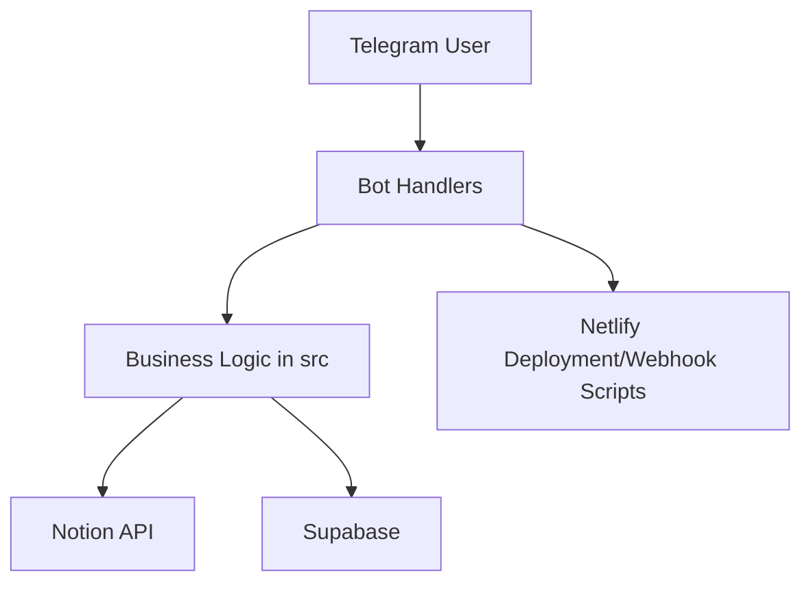
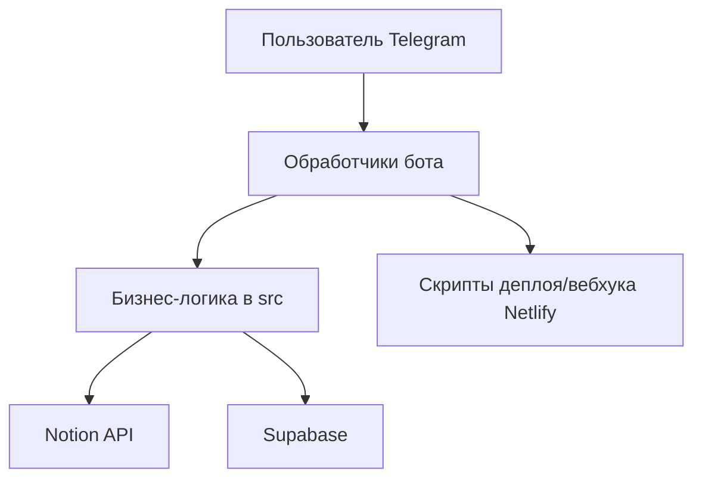

# Church Telegram Bot
[](https://github.com/DenisArger/church-management-js/actions/workflows/ci.yml)

## English

## Problem
Church teams need centralized communication workflows (announcements, schedules, polls, requests) without manual routine in chats.

## Solution
This project provides a TypeScript Telegram bot with Notion/Supabase integrations and Netlify deployment scripts for production operations.

## Tech Stack
- Node.js + TypeScript
- `node-telegram-bot-api`
- Notion API (`@notionhq/client`)
- Supabase (`@supabase/supabase-js`)
- Netlify Functions / Netlify CLI
- Jest + ESLint

## Architecture
Top-level structure:
```text
src/
netlify/
scripts/
docs/
debug-server.ts
package.json
```



## Features
- Telegram bot interaction flows
- Notion-backed content/data operations
- Supabase data integration
- Production scripts for setup, webhook, deploy
- Test and lint tooling for maintenance

## How to Run
```bash
yarn install
cp env.example .env
yarn dev
```

Useful commands:
```bash
yarn build
yarn test
yarn lint
yarn netlify:dev
```

## Русский

## Проблема
Церковным командам нужен централизованный инструмент для коммуникации (анонсы, расписания, опросы, заявки) без ручной рутины в чатах.

## Решение
Проект реализует Telegram-бота на TypeScript с интеграциями Notion/Supabase и скриптами деплоя через Netlify.

## Стек
- Node.js + TypeScript
- `node-telegram-bot-api`
- Notion API (`@notionhq/client`)
- Supabase (`@supabase/supabase-js`)
- Netlify Functions / Netlify CLI
- Jest + ESLint

## Архитектура
Верхнеуровневая структура:
```text
src/
netlify/
scripts/
docs/
debug-server.ts
package.json
```



## Возможности
- Диалоги и обработчики команд Telegram-бота
- Работа с данными/контентом через Notion
- Интеграция с Supabase
- Продакшен-скрипты для setup, webhook и deploy
- Тесты и линтинг для сопровождения

## Как запустить
```bash
yarn install
cp env.example .env
yarn dev
```

Полезные команды:
```bash
yarn build
yarn test
yarn lint
yarn netlify:dev
```
