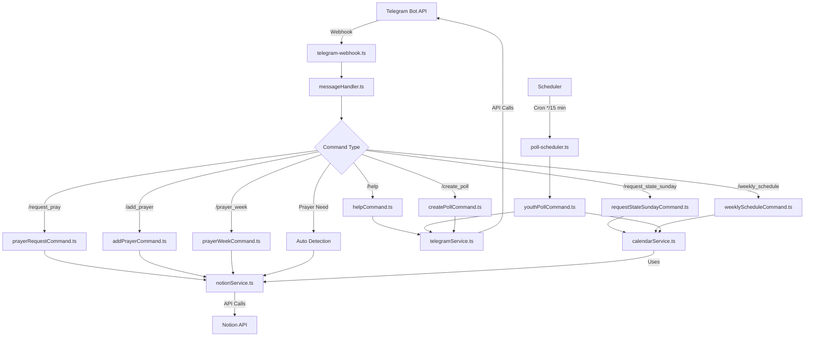
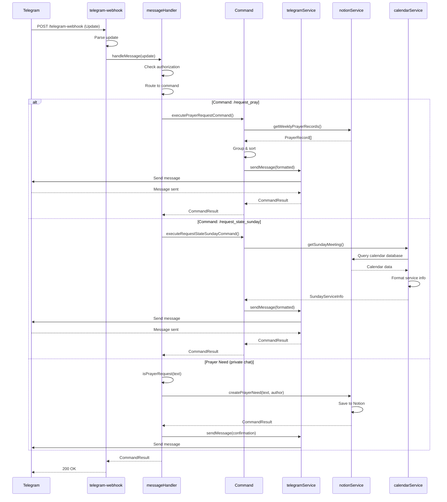
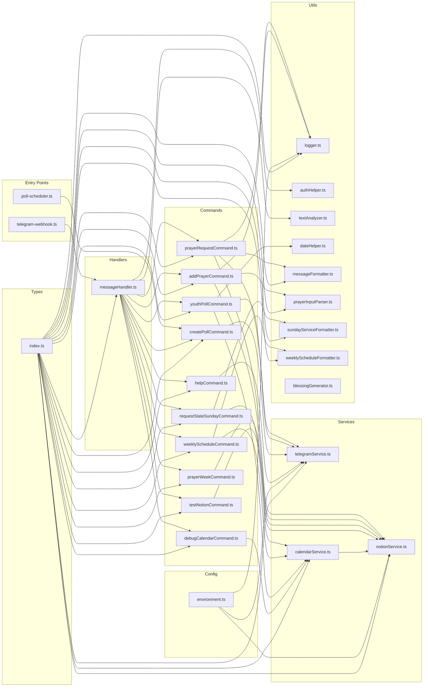

# Диаграммы

## Архитектура системы

```mermaid
flowchart TD
    A[Telegram Bot API] -->|Webhook| B[telegram-webhook.ts]
    C[Scheduler] -->|Cron */15 min| D[poll-scheduler.ts]
    
    B --> E[messageHandler.ts]
    D --> F[youthPollCommand.ts]
    
    E --> G{Command Type}
    G -->|/help| H[helpCommand.ts]
    G -->|/request_pray| I[prayerRequestCommand.ts]
    G -->|/add_prayer| J[addPrayerCommand.ts]
    G -->|/request_state_sunday| L[requestStateSundayCommand.ts]
    G -->|/weekly_schedule| M[weeklyScheduleCommand.ts]
    G -->|/prayer_week| N[prayerWeekCommand.ts]
    G -->|/create_poll| O[createPollCommand.ts]
    G -->|Prayer Need| P[Auto Detection]
    
    H --> Q[telegramService.ts]
    I --> R[notionService.ts]
    J --> R
    L --> S[calendarService.ts]
    M --> S
    N --> R
    F --> S
    F --> Q
    O --> Q
    P --> R
    
    Q -->|API Calls| A
    R -->|API Calls| T[Notion API]
    S -->|Uses| R
```

## Поток обработки сообщения

```mermaid
sequenceDiagram
    participant TG as Telegram
    participant WH as telegram-webhook
    participant MH as messageHandler
    participant CMD as Command
    participant TS as telegramService
    participant NS as notionService
    participant CS as calendarService
    
    TG->>WH: POST /telegram-webhook (Update)
    WH->>WH: Parse update
    WH->>MH: handleMessage(update)
    MH->>MH: Check authorization
    MH->>MH: Route to command
    
    alt Command: /request_pray
        MH->>CMD: executePrayerRequestCommand()
        CMD->>NS: getWeeklyPrayerRecords()
        NS-->>CMD: PrayerRecord[]
        CMD->>CMD: Group & sort
        CMD->>TS: sendMessage(formatted)
        TS->>TG: Send message
        TG-->>TS: Message sent
        TS-->>CMD: CommandResult
        CMD-->>MH: CommandResult
    else Command: /request_state_sunday
        MH->>CMD: executeRequestStateSundayCommand()
        CMD->>CS: getSundayMeeting()
        CS->>NS: Query calendar database
        NS-->>CS: Calendar data
        CS->>CS: Format service info
        CS-->>CMD: SundayServiceInfo
        CMD->>TS: sendMessage(formatted)
        TS->>TG: Send message
        TG-->>TS: Message sent
        TS-->>CMD: CommandResult
        CMD-->>MH: CommandResult
    else Prayer Need (private chat)
        MH->>MH: isPrayerRequest(text)
        MH->>NS: createPrayerNeed(text, author)
        NS->>NS: Save to Notion
        NS-->>MH: CommandResult
        MH->>TS: sendMessage(confirmation)
        TS->>TG: Send message
    end
    
    MH-->>WH: CommandResult
    WH-->>TG: 200 OK
```

## Структура модулей

```mermaid
graph LR
    subgraph Entry["Entry Points"]
        WH[telegram-webhook.ts]
        SCH[poll-scheduler.ts]
    end
    
    subgraph Handlers["Handlers"]
        MH[messageHandler.ts]
    end
    
    subgraph Commands["Commands"]
        C1[helpCommand.ts]
        C2[prayerRequestCommand.ts]
        C3[addPrayerCommand.ts]
        C4[requestStateSundayCommand.ts]
        C5[weeklyScheduleCommand.ts]
        C6[prayerWeekCommand.ts]
        C7[youthPollCommand.ts]
        C8[createPollCommand.ts]
        C9[debugCalendarCommand.ts]
        C10[testNotionCommand.ts]
    end
    
    subgraph Services["Services"]
        TS[telegramService.ts]
        NS[notionService.ts]
        CS[calendarService.ts]
    end
    
    subgraph Utils["Utils"]
        U1[logger.ts]
        U2[authHelper.ts]
        U3[textAnalyzer.ts]
        U4[dateHelper.ts]
        U5[messageFormatter.ts]
        U6[prayerInputParser.ts]
        U7[sundayServiceFormatter.ts]
        U8[weeklyScheduleFormatter.ts]
        U9[blessingGenerator.ts]
    end
    
    subgraph Config["Config"]
        ENV[environment.ts]
    end
    
    subgraph Types["Types"]
        TYPES[index.ts]
    end
    
    WH --> MH
    SCH --> C8
    MH --> C1
    MH --> C2
    MH --> C3
    MH --> C4
    MH --> C5
    MH --> C6
    MH --> C7
    MH --> C8
    MH --> C9
    MH --> C10
    
    C2 --> TS
    C2 --> NS
    C3 --> NS
    C4 --> CS
    C5 --> CS
    C6 --> NS
    C7 --> CS
    C7 --> TS
    C8 --> TS
    C9 --> CS
    C10 --> NS
    
    CS --> NS
    C1 --> TS
    C2 --> U5
    C3 --> U6
    C4 --> U7
    C5 --> U8
    C7 --> U4
    
    MH --> U2
    MH --> U3
    C2 --> U1
    C3 --> U1
    
    ENV --> TS
    ENV --> NS
    ENV --> U1
    
    TYPES --> MH
    TYPES --> C1
    TYPES --> C2
    TYPES --> C3
    TYPES --> C4
    TYPES --> C5
    TYPES --> C6
    TYPES --> C7
    TYPES --> C8
    TYPES --> C9
    TYPES --> C10
    TYPES --> TS
    TYPES --> NS
    TYPES --> CS
    TYPES --> U1
    TYPES --> U5
    TYPES --> U6
    TYPES --> U7
    TYPES --> U8
```

---

[← Назад к содержанию](README.md)

